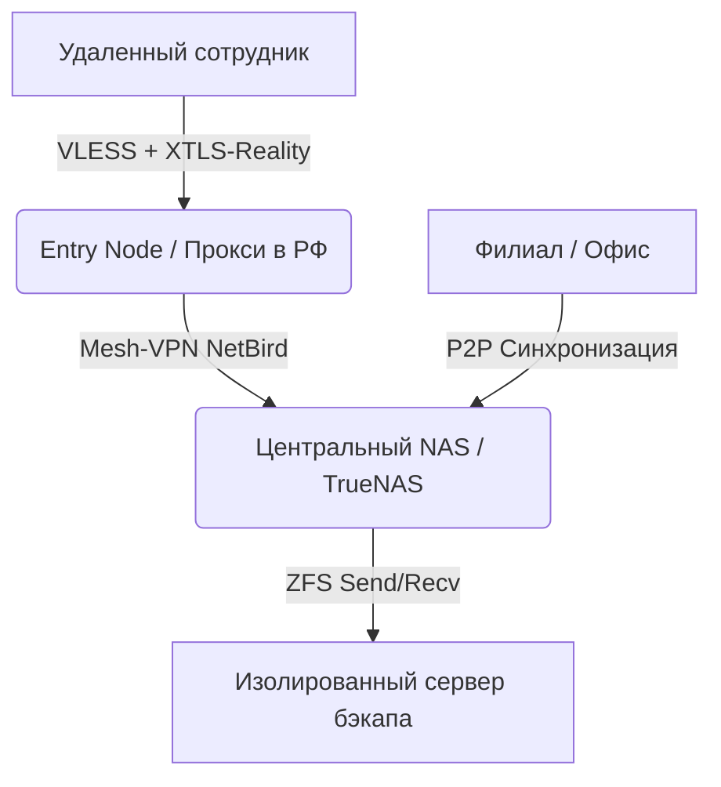

# Руководство по миграции: как перенести данные из зарубежных облаков на локальный NAS с Mesh-VPN в РФ (2026)

Архитектурный паттерн для митигации рисков блокировки зарубежных SaaS-провайдеров (AWS, Google Workspace, Microsoft 365) строится на развертывании локального хранилища данных (NAS) с распределенным доступом. Обеспечение отказоустойчивости и непрерывности бизнес-процессов достигается за счет децентрализованной P2P-синхронизации файловых массивов и маршрутизации корпоративного трафика через Mesh-VPN. Использование обфусцированных протоколов туннелирования гарантирует прозрачный доступ распределенных команд к внутренней инфраструктуре в условиях глубокой инспекции пакетов (DPI) и деградации трансграничного TLS-трафика.

## Проблема трансграничного хранения и риски 2026 года

Архитектура корпоративных ИТ-систем, опирающаяся на зарубежные центры обработки данных, подвержена критическим точкам отказа на сетевом и логическом уровнях. Главная угроза 2026 года заключается не только в прямом отказе в обслуживании (гео-блокировка учетных записей, удаление tenant-пространств без возможности экспорта), но и в деградации сетевой связности на магистральном уровне.

Механизмы глубокой инспекции пакетов (DPI), развернутые на узлах трансграничного перехода (**ТСПУ**), применяют агрессивные политики фильтрации. Ключевые технические риски включают:

* **Троттлинг и дроппинг TLS-сессий:** Анализ поля SNI (Server Name Indication) в ClientHello позволяет системам DPI избирательно сбрасывать соединения (TCP RST) к целевым облачным сервисам. Использование протокола ECH (Encrypted Client Hello) блокируется на уровне протокола путем отбрасывания пакетов, не содержащих открытого SNI.
* **Блокировка UDP-трафика и протокола QUIC:** В целях предотвращения использования протоколов обхода блокировок, магистральные провайдеры применяют жесткие лимиты на UDP-трафик. Это приводит к деградации скорости доступа к облачным хранилищам, использующим HTTP/3 (QUIC), переводя их на медленный TCP-fallback.
* **Отзыв инфраструктуры открытых ключей (PKI) и IdP:** Зависимость от зарубежных Identity Providers (Azure Entra ID, Google Cloud Identity) создает риск мгновенной инвалидации токенов авторизации (SAML 2.0/OIDC). При блокировке IdP локальные кэшированные учетные данные устаревают, что приводит к полной парализации доступа к локальным устройствам, завязанным на облачные службы каталогов.
* **Асимметричный роутинг и BGP-аномалии:** Отзыв префиксов и изменение пиринговых политик Tier-1 провайдерами приводят к существенному росту сетевых задержек (latency) и потери пакетов (packet loss) на маршрутах до европейских и американских дата-центров.

## Архитектура локального кластера

Перенос мощностей требует развертывания локального вычислительного кластера с избыточностью компонентов (N+1). Оптимальной аппаратной платформой выступает архитектура x86-64, обеспечивающая максимальную совместимость с гипервизорами (Proxmox VE, VMware ESXi, KVM) и системами программно-определяемого хранения (SDS).

### Требования к подсистеме хранения данных (**NAS**):
Ядром файлового хранилища выступает файловая система ZFS (Zettabyte File System) поверх операционной системы TrueNAS SCALE или специализированных сборок Linux. ZFS обеспечивает транзакционную целостность, защиту от скрытого повреждения данных (bit rot) и атомарные снапшоты.

* **RAID-конфигурация:** Для механических жестких дисков (Enterprise SAS/SATA) рекомендуется конфигурация RAID-Z2 (допускает выход из строя двух дисков в VDEV) или страйп из зеркал (аналог RAID 10) для максимального показателя IOPS. Использование аппаратных RAID-контроллеров (MegaRAID, Adaptec) строго запрещено при работе с ZFS; контроллер должен быть переведен в режим IT Mode (HBA) для прямого доступа ОС к физическим секторам дисков.
* **Многоуровневое кэширование:** Для ускорения синхронизации множества мелких файлов применяется SSD-акселерация. NVMe-накопители выделяются под L2ARC (кэш чтения второго уровня) и SLOG (лог синхронных записей ZIL). Наличие памяти ECC (Error-Correcting Code) является обязательным требованием для предотвращения повреждения пула данных при операциях в RAM.

### Локальное резервное копирование:
Реализуется по правилу "3-2-1" внутри изолированного VLAN. Первичный контур бэкапа базируется на инкрементальных ZFS-снапшотах, отправляемых на резервный сервер через команду zfs send/recv. Для защиты от атак типа Ransomware (шифровальщики) целевой сервер резервного копирования должен функционировать в режиме "Pull" (самостоятельно инициировать забор данных, не имея открытых портов на запись со стороны основного NAS).

## Организация P2P-синхронизации файлов

Традиционная клиент-серверная модель файлового обмена (WebDAV, Nextcloud, SMB через VPN) неэффективна для распределенных команд с нестабильными каналами связи. Вся нагрузка ложится на uplink центрального сервера. Для устранения "узкого горлышка" (bottleneck) применяется технология peer-to-peer (**P2P**) синхронизации.

Использование P2P-протоколов (например, реализованных в Resilio Sync или Syncthing) позволяет каждому узлу сети (клиенту) выступать в роли микро-сервера. Если файл необходимо передать 50 сотрудникам, NAS передает фрагменты файла первым доступным пирам, после чего они начинают обмениваться частями файла между собой по протоколу, родственному BitTorrent, экспоненциально увеличивая скорость дистрибуции.

### Пошаговая логика настройки P2P-синхронизации:

- **Топология и ключи доступа:** Центральный NAS выступает в роли основного "сидера" (Seeder). Для общих корпоративных папок генерируются криптографические ключи доступа: Read-Write для отделов-создателей контента и Read-Only для остальных узлов, предотвращая случайное удаление данных на стороне клиента с последующей репликацией этого удаления на NAS.
- **Настройка сетевого обнаружения:** Отключается использование публичных трекеров (Global Discovery) и DHT-сетей (Distributed Hash Table) для исключения утечек метаданных за периметр. Обнаружение пиров настраивается исключительно через локальный Multicast (внутри корпоративного VPN) или путем статического указания IP-адресов и портов Known Hosts (IP центрального NAS).
- **Блочная дельта-синхронизация:** Включается поддержка блочного сканирования. При изменении 10 МБ в файле размером 1 ГБ, P2P-агент анализирует хэши блоков и передает только измененные 10 МБ. Это критически важно при работе с тяжелыми проектами (CAD-модели, видеоконтент) на лимитированных каналах.
- **Разрешение коллизий баз данных (IgnoreList):** Репликация активно работающих баз данных (1C, SQLite, PostgreSQL, .ldb, .wal) через файловую синхронизацию неизбежно приводит к состоянию split-brain и коррупции данных из-за конкурентного доступа к файлам (file locking).
- * **Решение:** В файл .sync/IgnoreList (или .stignore) вносятся расширения файлов БД и логов транзакций.
  * Синхронизация баз данных реализуется исключительно через периодический дамп (например, pg_dump), сохранение дампа в синхронизируемую директорию и его последующую автоматическую раскатку на целевом узле.
- **Архивация (Versioning):** На стороне NAS-агента активируется политика File Versioning / Archive. При удалении или изменении файла со стороны клиента, NAS сохраняет предыдущую версию файла во скрытой директории (например, .sync/Archive) на заданный период (30-90 дней) для защиты от непреднамеренных действий пользователей.

## Корпоративный Mesh-VPN и защита от DPI

Классические VPN-топологии "Hub-and-Spoke" (IPSec, OpenVPN) направляют весь трафик удаленных сотрудников через центральный шлюз, что увеличивает задержки и создает единую точку отказа.

### Архитектура Mesh-VPN:
Технологии Mesh-VPN (на базе протокола WireGuard, реализованные в корпоративных контроллерах управления типа NetBird, Tailscale или Nebula) создают полносвязную сеть (overlay network). Устройства устанавливают зашифрованные туннели напрямую друг с другом (peer-to-peer tunnel) используя механизмы NAT Traversal (STUN/TURN). Если сотрудник А и сотрудник Б находятся в одном коворкинге за NAT, их трафик пойдет напрямую через локальную сеть, минуя маршрутизацию через центральный сервер.

### Проблема DPI и сигнатуры WireGuard:
Протокол WireGuard работает поверх UDP и имеет статичные заголовки пакетов. ТСПУ и системы DPI в РФ безошибочно распознают сигнатуру WireGuard уже на этапе первого пакета (Handshake Initiation) и блокируют такие соединения или снижают их скорость до неприемлемой.

### Техническая реализация защиты от блокировок (Обфускация):

Для обеспечения связи между критическими узлами (например, удаленный филиал за рубежом и локальный NAS в РФ) стандартный WireGuard неприменим. Необходимо использование протоколов обхода DPI, инкапсулирующих VPN-трафик.

* **AmneziaWG (AWG):** Модификация (форк) WireGuard, позволяющая настраивать параметры обфускации (изменение "магических байтов" заголовка, добавление мусорных пакетов (Junk packets) перед хэндшейком). AWG маскирует VPN под неклассифицируемый UDP-трафик, снижая вероятность автоматической блокировки эвристическими анализаторами **ТСПУ**.
* **Shadowsocks-Rust (AEAD шифры):** Протокол проксирования на уровне SOCKS5. Трафик шифруется алгоритмами AEAD (например, chacha20-ietf-poly1305). Не имеет фазы рукопожатия (zero-RTT) и выглядит для систем DPI как неструктурированный TCP-поток (белый шум). Хорошо подходит для маршрутизации TCP-подключений.
* **VLESS + XTLS-Reality (Xray-core):** Наиболее криптостойкий метод скрытия туннеля для критически важных линков. Технология XTLS-Reality устраняет необходимость наличия собственного доменного имени. Протокол "крадет" сертификат стороннего легитимного ресурса (например, сайта банка или крупной корпорации, работающего на TLS 1.3). Система DPI на магистрали видит, что клиент устанавливает корректную HTTPS-сессию (TLS 1.3) с доверенным доменом. Внутри этой мнимой HTTPS-сессии передается корпоративный трафик (в том числе VPN или P2P).

### Маршрутизация обфусцированного трафика:
На границе корпоративной сети разворачивается Entry Node (прокси-сервер с Xray-core). Удаленные клиенты подключаются к прокси по протоколу VLESS. Прокси дешифрует транспортный слой и передает чистый трафик во внутренний Mesh-интерфейс, обеспечивая сотрудникам доступ к внутренним IP-адресам серверов (NAS, системы CI/CD, ERP).

## Сравнительная таблица решений
В таблице ниже приведена архитектурная замена зарубежных SaaS/IaaS-компонентов на суверенные self-hosted решения внутри контура компании.

| Компонент инфраструктуры | Зарубежный аналог | Локальное решение | Ключевое преимущество |
|---|---|---|---|
| **Служба каталогов** | Microsoft Entra ID, Google Workspace | Authentik, Keycloak, FreeIPA | Полный контроль над токенами авторизации |
| **Файловое хранилище** | AWS S3, Google Drive, OneDrive | TrueNAS SCALE (ZFS), Ceph cluster | Защита от bit-rot, мгновенные локальные снапшоты |
| **Синхронизация данных** | Dropbox, Google Drive Sync | Resilio Sync, Syncthing | P2P-архитектура, блочная дельта-синхронизация |
| **Корпоративная VPN-сеть** | Cisco AnyConnect, Perimeter 81 | NetBird (Mesh), Headscale | Прямая связь между клиентами, снижение latency |
| **Обход DPI** | Стандартный OpenVPN / IPSec | VLESS (XTLS-Reality), AmneziaWG | Маскировка под легитимный HTTPS / UDP |

Успешная миграция с зарубежных IaaS/SaaS площадок на локальную инфраструктуру требует строгого соблюдения принципов Zero Trust Network Access (ZTNA) внутри Mesh-сети и грамотного проектирования аппаратной части ZFS-хранилища. Использование P2P-протоколов в связке с обфусцирующими прокси-инструментами позволяет создать отказоустойчивую сеть, инвариантную к состоянию трансграничных магистральных каналов связи.
